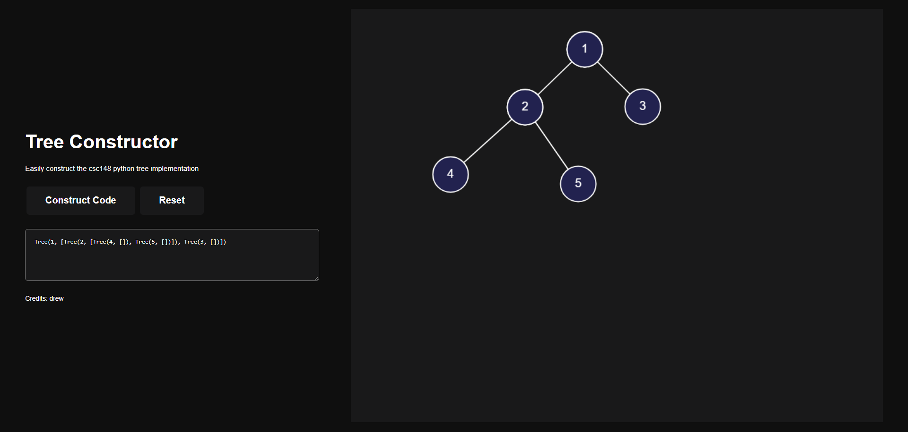

# Tree Constructor
[Tree Constructor](https://drewgallinger.github.io/Tree-Constructor/)

Easily create the code to implement trees just by drawing them. I decided to make this after being annoyed with writing out the long tree constructions.

The Tree implementation is the way they implement it in CSC148.

## Usage

Just Click anywhere on the canvas to place down your root. Then click that root and anywhere else to create a subtree. Then repeat.

Once you have finished your tree, you can click on the "Construct Code" button and your code will appear.

## Contributing

Contributions are always welcome and very well needed! This was some of my first code I have ever written and I just know it is bad. CSS is all messed up aswell if you would like to collaborate just send a PR and I will look. :)

